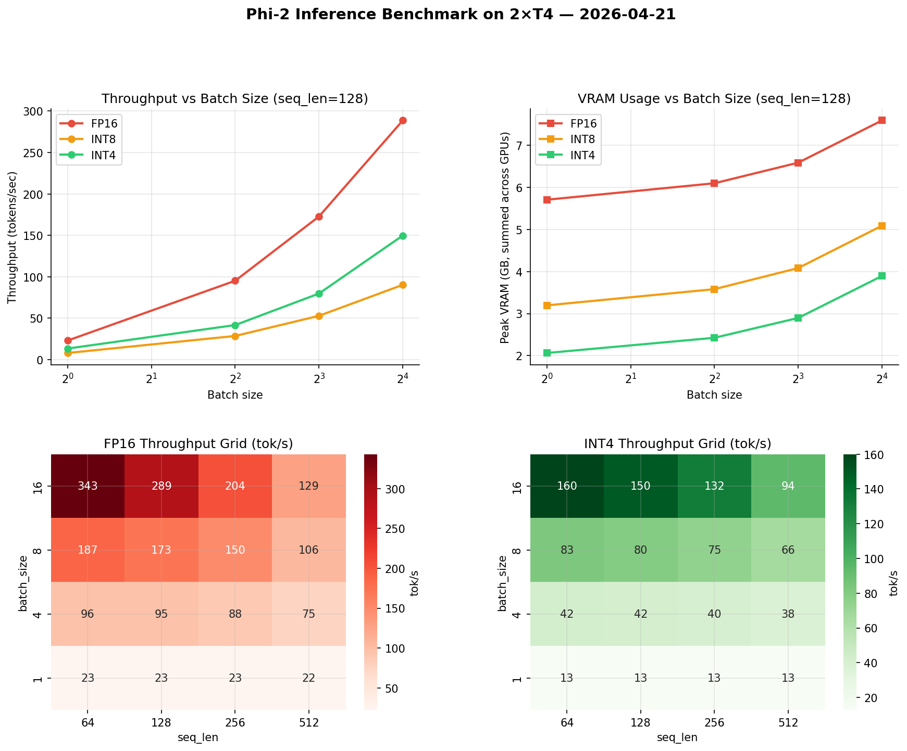

# llm-inference-benchmark

Benchmarks `microsoft/phi-2` inference throughput, latency, time-to-first-token, and VRAM across FP16 / INT8 / INT4 quantization and batch sizes 1–16 on dual NVIDIA T4 GPUs.

---

## Motivation

Quantization is widely recommended as a way to make LLM inference faster and cheaper. But the standard claim — "INT4 is faster than FP16" — depends heavily on model size, hardware, and batch size in ways that are rarely documented together. This benchmark measures all three quantization levels across a 4×4 grid of batch sizes and sequence lengths to find where that claim holds, where it breaks down, and what the real tradeoff is on commodity hardware.

The results matter for anyone deciding how to deploy a model under real constraints — whether the bottleneck is speed, VRAM, or the cost of serving concurrent users.

---

## Hardware & Environment

| | |
|---|---|
| GPU | 2× NVIDIA Tesla T4 (15.8 GB each, 31.6 GB total) |
| CUDA | 12.8 |
| Python | 3.12 |
| PyTorch | 2.x |
| transformers | 5.0.0 |
| bitsandbytes | 0.49.2 |

---

## Experiment Design

**Model:** `microsoft/phi-2` (2.7B parameters)

**Quantization levels:**
| Level | Method | Weight size |
|---|---|---|
| FP16 | Native half-precision | 2 bytes/param → ~5.4 GB |
| INT8 | LLM.int8() mixed-precision decomposition | 1 byte/param → ~2.7 GB |
| INT4 | NF4 + double quantization (bitsandbytes) | 0.5 bytes/param → ~1.4 GB |

**Grid:** 4 batch sizes (1, 4, 8, 16) × 4 sequence lengths (64, 128, 256, 512 tokens) = 16 configurations per quantization level, 48 total.

**Measurement:** 2 warmup runs discarded, 10 timed runs per configuration. `torch.cuda.synchronize()` called before and after every timed block. TTFT measured separately with `max_new_tokens=1` to isolate prefill from decode.

**Input:** Deterministic random tokens (seed=42) at exact target lengths. `do_sample=False` (greedy decoding) for timing stability.

---

## Results

### Summary (batch=1, seq_len=128 — standard single-user config)

| Quantization | Throughput (tok/s) | Latency (ms/tok) | TTFT (ms) | Peak VRAM (GB) | vs FP16 |
|---|---|---|---|---|---|
| FP16 | 22.94 | 43.58 | 51.57 | 5.70 | 1.00× (baseline) |
| INT8 | 7.93 | 126.10 | 158.57 | 3.20 | 0.35× (slower) |
| INT4 | 13.27 | 75.37 | 97.37 | 2.06 | 0.58× (slower) |

### Full Throughput Grid (tok/s)

**FP16:**
| batch \ seq_len | 64 | 128 | 256 | 512 |
|---|---|---|---|---|
| 1 | 23 | 23 | 23 | 22 |
| 4 | 96 | 95 | 88 | 75 |
| 8 | 187 | 173 | 150 | 106 |
| 16 | **343** | 289 | 204 | 129 |

**INT4:**
| batch \ seq_len | 64 | 128 | 256 | 512 |
|---|---|---|---|---|
| 1 | 13 | 13 | 13 | 13 |
| 4 | 42 | 42 | 40 | 38 |
| 8 | 83 | 80 | 75 | 66 |
| 16 | 160 | 150 | 132 | 94 |

### Charts



---

## Key Findings

**1. For a 2.7B model on T4, quantization is a memory tool — not a speed tool.**
FP16 outperforms both INT8 and INT4 on throughput at every single configuration tested. The peak FP16 throughput of 343 tok/s at batch=16, seq_len=64 was never approached by either quantized level. On small models at small-to-medium batch sizes, dequantization overhead costs more than bandwidth savings return.

**2. INT4 delivers a genuine 64% VRAM reduction (5.70 → 2.06 GB).**
This is the real case for INT4 — not speed, but accessibility. On a GPU with 6–8 GB VRAM (RTX 3060, RTX 3070), FP16 Phi-2 would be pushing the memory limit at batch=16 while INT4 still has headroom. Quantization expands what is *possible* on constrained hardware, even when it doesn't make things faster.

**3. INT8 offers neither speed nor memory efficiency compared to INT4.**
INT8 was the slowest quantization level at every configuration — reaching as low as 0.29× FP16 throughput at batch=16, seq_len=64. LLM.int8()'s mixed-precision decomposition (outlier columns in FP16, remainder in INT8) adds per-layer overhead that only amortizes on larger models and larger batch sizes than tested here. INT8 uses more VRAM than INT4 while being slower — there is no operating point in this grid where INT8 is the right choice for Phi-2 on T4.

**4. INT4 throughput is uniquely stable across sequence lengths.**
FP16 throughput at batch=1 drops from 23 tok/s at seq_len=64 to 22 tok/s at seq_len=512 — a small drop. But at batch=16, FP16 drops from 343 to 129 tok/s (−62%) as sequence length increases. INT4 at batch=16 drops from 160 to 94 tok/s (−41%). INT4's bottleneck is dequantization overhead, which is constant per layer regardless of sequence length — making it more stable under longer-context workloads.

**5. TTFT scales super-linearly with sequence length — the attention quadratic is becoming visible.**
At FP16, batch=1: seq_len=64 → 45.4 ms, seq_len=128 → 51.6 ms (+14%), seq_len=256 → 77.7 ms (+71%), seq_len=512 → 129.4 ms (+185%). Doubling from 64→128 adds 6 ms. Doubling from 256→512 adds 52 ms. This is the O(n²) attention complexity beginning to dominate at longer prompts.

**6. No OOM events across all 48 configurations.**
With 31.6 GB total VRAM across 2×T4, Phi-2 at any quantization level fits comfortably at all tested batch sizes and sequence lengths. The memory headroom freed by INT4 would matter on single-GPU deployments with ≤8 GB VRAM.

---

## What I Would Investigate Next

- **Larger models (7B, 13B):** The crossover point where INT4 *does* beat FP16 on throughput likely exists on larger models where FP16 weights genuinely saturate the memory bus. Phi-2 at 2.7B may simply be too small for the bandwidth savings to dominate.
- **Single-GPU vs dual-GPU:** The `device_map="auto"` layout used here splits layers across both T4s, adding PCIe transfer overhead every forward pass. Benchmarking Phi-2 on a single T4 would likely show higher throughput for all quant levels by eliminating inter-device traffic.
- **vLLM / TensorRT-LLM comparison:** This benchmark measures raw `transformers + bitsandbytes` — a useful baseline. Comparing against an optimized serving engine would quantify the gap between "default" and "production-optimized" inference.
- **Larger batch sizes (32, 64):** FP16 throughput was still scaling steeply at batch=16 with no sign of flattening — the GPU compute ceiling was not reached. Testing higher batch sizes would find where FP16 saturates and whether quantization closes the gap there.

---

## Output Quality Validation

Five prompts run through all three quantization levels to confirm INT4 does not produce degraded output:

| Prompt | FP16 | INT4 |
|---|---|---|
| "The three primary colors are" | red, blue, and yellow. These colors cannot be created by mixing other colors together. | red, blue, and yellow. |
| "The main difference between TCP and UDP is" | that TCP is a connection-oriented protocol, while UDP is a connectionless protocol... | that TCP is a connection-oriented protocol, while UDP is a connectionless protocol... |
| "Explain in one sentence what a binary search tree is" | *(empty)* | A binary search tree is a data structure that stores values in nodes... |

All three quantization levels produce coherent, accurate output on well-formed prompts. On ambiguous prompts (SQL without schema context, open-ended definitions), all three fail equally — confirming the failure is prompt-driven, not precision-driven. One exception: INT4 produced a correct BST definition where FP16 and INT8 returned empty — likely due to numerical differences at a generation threshold rather than a genuine quality difference.

Full validation output: [`results/output_validation.csv`](results/output_validation.csv)

---

**Hardware used:** 2× NVIDIA Tesla T4 (16 GB each), CUDA 12.8
**Full notebook:** [`notebooks/phi2_inference_benchmark.ipynb`](notebooks/phi2-inference-benchmark.ipynb)

---

## Repository Structure

```
llm-inference-benchmark/
├── README.md
├── requirements.txt
├── notebooks/
│   └── phi2_inference_benchmark.ipynb
└── results/
    ├── bench_fp16.csv
    ├── bench_int8.csv
    ├── bench_int4.csv
    ├── bench_all.csv
    ├── bench_all_enriched.csv
    ├── results_summary.csv
    ├── output_validation.csv
    └── charts/
        └── benchmark_results.png
```
